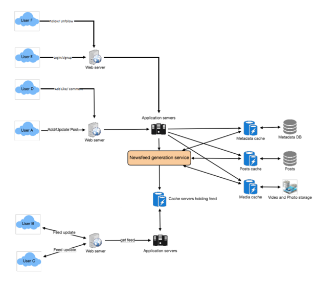

# Project Name: Simple Go-NewFeeds

## Overview

The Go-NewFeeds project is a backend service that manages user authentication, profile management, and social interactions such as following other users. The project is implemented in Go, with services interacting with a MySQL database and Redis for caching. Docker is used for containerization, and HTTP endpoints are provided for client interactions.

## Table of Contents

1. [Introduction](#introduction)
2. [Architecture](#architecture)
3. [Modules and Packages](#modules-and-packages)
4. [API Endpoints](#api-endpoints)
5. [Database Schema](#database-schema)
6. [External Dependencies](#external-dependencies)
7. [Deployment](#deployment)
8. [Testing](#testing)
9. [Future Work](#future-work)

## Introduction

The Go-NewFeeds project is designed to provide a simple social networking backend that handles user management and social connections. It includes features such as user signup, login, profile management, and the ability to follow other users.

## Architecture

### Components
- **Go Backend**: The core backend logic, including API endpoints and database interactions, is written in Go.
- **MySQL**: Used as the primary relational database for storing user information.
- **Redis**: Used as a caching layer to optimize performance.
- **Docker**: Containerizes the application for consistent deployment across environments.

### Directory Structure
- **cmd**: Contains the entry point for the application.
  - `main.go`: The main application entry point.
- **pkg**: Contains all packages for database connections, services, and utilities.
  - **conn**: Database and cache connections (MySQL and Redis).
  - **models**: Contains the data models and structures.
  - **utils**: Utility functions, including password hashing.
- **users-api**: Contains the user-related services and HTTP handlers.
  - `users/main.go`: Implements user-related functionalities like signup, login, etc.
- **newsfeed-api**: Contains the newsfeed-related services and HTTP handlers.
  - `newsfeed/main.go`: Implements newsfeed service like getting newsfeed.
  - `newsfeed/newsfeed_tasks.go`: Implement logic for async worker gen newsfeed for each users and store inside Redis cache. We using `asyncq` library for worker management
- **docker**: Docker-related configuration files.
  - `Dockerfile`: Defines the Docker image build instructions.
  - `docker-compose.yml`: Manages multi-container Docker applications.
- **scripts**: Initialization scripts.
  - `mysql-init`: Contains SQL initialization scripts.
- **.env**: Configuration file for environment variables.
- **README.md**: Project documentation.

## Modules and Packages

### Connection Packages (`pkg/conn`)
- `mysql_client.go`: Handles MySQL database connections.
- `redis_client.go`: Manages Redis cache connections.
- `minio_client.go`: Manages Minio connection
- `asyncq_client.go`: Manages AsyncQ Worker connection

### Model Packages (`pkg/models`)
- `user_db.go`: Defines user database models and interactions.
- `post_db.go`: Defines post database models and interactions.
- `posts_cache.go`: Defines post cache models and interactions.
- `records.go`: Maintains records of request payload
- `session_storage.go`: Maintain session cache models and interaction
- `image_storage.go`: Maintain image storage model on Blob Storage and interaction

### Utilities (`pkg/utils`)
- `password.go`: Provides functions for password hashing and verification.

### Database Schema
- `Users` Table: Stores user information such as first name, last name, email, username, password (hashed), and date of birth. 
- `Posts` Table: Stores posts created by users.
- `User-User` Table: Tracks user connections (who follows whom).
- `Like` Table: Track user like post
- `Comment` Table: Track user comment on certain post

Details in `scripts/mysql-init/init.sql`

### External Dependencies
- `Go Modules`: Lists all external Go modules required by the application.
- `MySQL`: The relational database system used for persistent storage.
- `Redis`: Used as an in-memory data structure store for caching.
- `MinIO`: Image Storage
- `AsyncQ Go`: for managing Async worker

### Deployment
#### Docker
- `Dockerfile`: Defines the steps to build the Docker image.
- `docker-compose.yml`: Used for deploying the application and its dependencies as Docker containers.

#### Run local
- Run `docker-compose up` for running a whole system

### Environment Variables
- `.env`: Manages environment-specific configurations.

### Future Work
- Optimizing system with NoSQL
- Unit testing and Integration testing
- Add rate-limiting for API endpoints to prevent abuse.